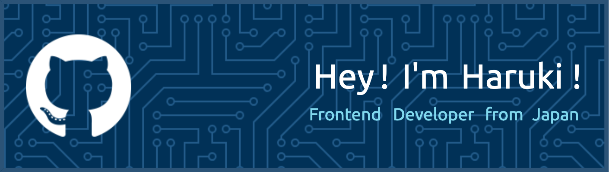
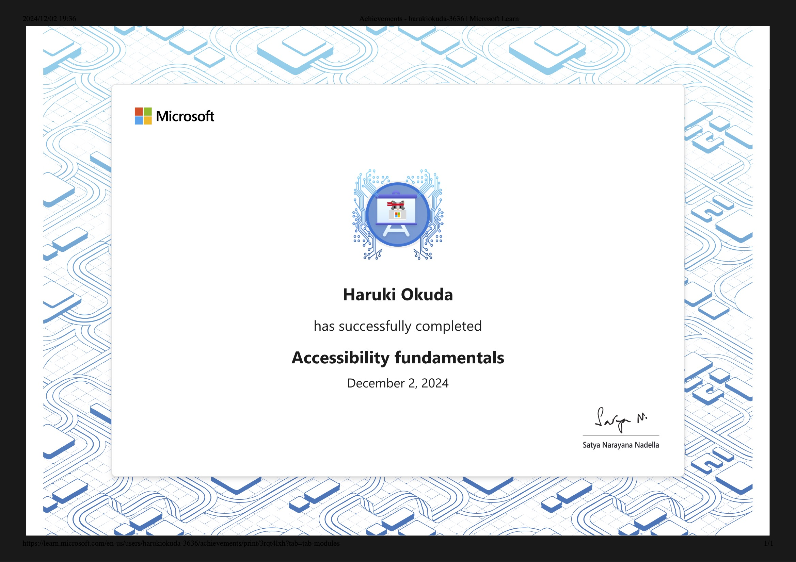
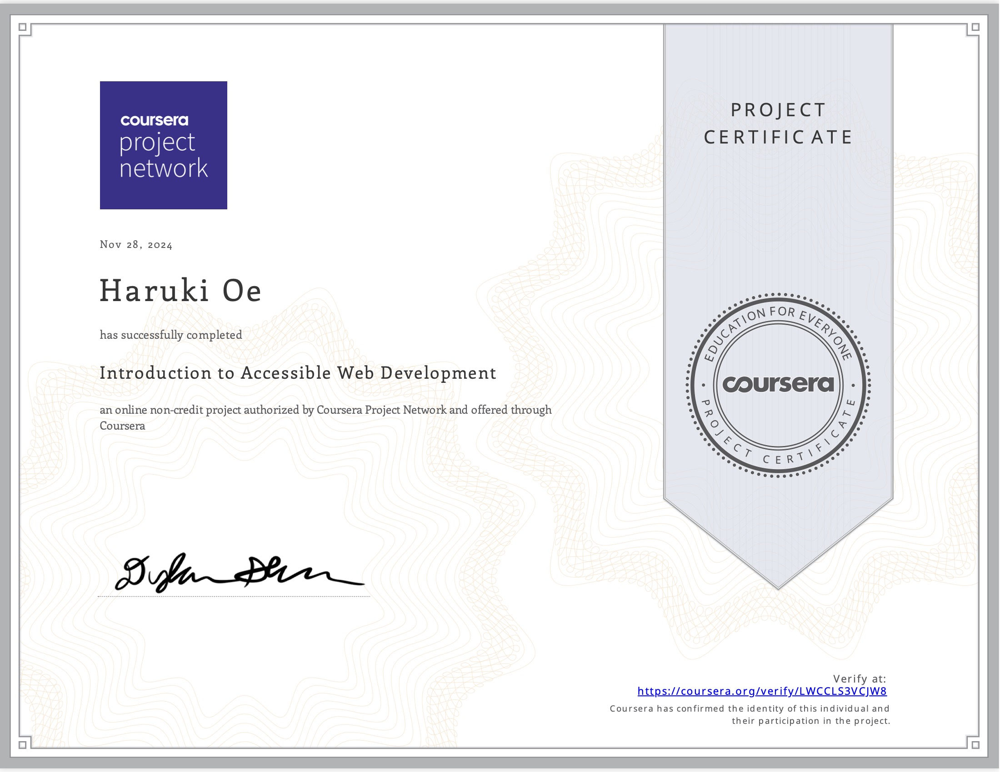

<!--  -->

##  My Skills

  
  
  
  
  
  
  
  
  
  
  

##  Work Experience

<table style="width: 100%; border-collapse: collapse;">
  <thead>
    <tr>
      <th width="15%">期間</th>
      <th width="35%">社名</th>
      <th width="50%">業務内容</th>
    </tr>
  </thead>
  <tbody>
    <tr>
      <td>2023 - 現在</td>
      <td>LINEヤフー株式会社 (旧称: LINE株式会社)</td>
      <td>月間利用者7,700万人、月間154億 PV を超える LINE NEWS のエンドユーザー向け画面の開発に従事。</td>
    </tr>
    <tr>
      <td>2021 - 2023</td>
      <td>LINE株式会社 (旧称: LINE Growth Technology株式会社)</td>
      <td>同 LINE NEWS の媒体社向け管理画面の開発に従事。</td>
    </tr>
    <tr>
      <td>2018 - 2021</td>
      <td>株式会社トリアナ</td>
      <td>大学3年次から企業の HP 制作や、EC サイトの構築、婚活事業の Web アプリケーションの開発などに従事。</td>
    </tr>
  </tbody>
</table>

##  Writing

### Zenn

<!-- ZENN-POST-LIST:START -->
- 2024-11-27 [大規模なコード変更を小さなPRに分割するテクニック](https://zenn.dev/harryduck/articles/large-code-changes-into-smaller-prs)
- 2023-05-30 [エンジニアが個人情報保護士に合格したので、その感想と効率的な勉強方法を公開する](https://zenn.dev/harryduck/articles/2b9001e63eeeb1)
- 2022-10-23 [主要なHTTPメソッドのざっくりした違い for フロントエンドエンジニア](https://zenn.dev/harryduck/articles/2d7c1f1716833a)
- 2022-08-28 [やってみたら意外と簡単！はじめてのOSSコントリビュート](https://zenn.dev/harryduck/articles/00d700ef4d98fa)
- 2022-05-02 [【Vue】&lt;script setup&gt;をサクッと使ってみる](https://zenn.dev/harryduck/articles/7550e7fd938db5)<!-- ZENN-POST-LIST:END -->

### note

<!-- NOTE-POST-LIST:START -->
- 2024-06-22 [会社で悩みを打ち明けることは、自分のためだけではなくチームのためにもなるという話](https://note.com/okuda_haruki/n/nb95bf39a78ea)
- 2023-07-25 [世阿弥が残した『初心忘るべからず』の本当の意味を自己肯定感の低い人に贈りたい](https://note.com/okuda_haruki/n/n8c985351334e)
- 2023-06-27 [オフィスに鳴る電話、母との20年ぶりの再会、そして家族の愛を知る。](https://note.com/okuda_haruki/n/n48d2f31d49e9)<!-- NOTE-POST-LIST:END -->

<!-- ##  My Stats -->

<!--  -->

##  Certifications

|コース名|プラットフォーム|修了証|
|-|-|-|
|Accessibility fundamentals|Microsoft Learn||
|Introduction to Accessible Web Development|Coursera||

##  Connect With Me

  

